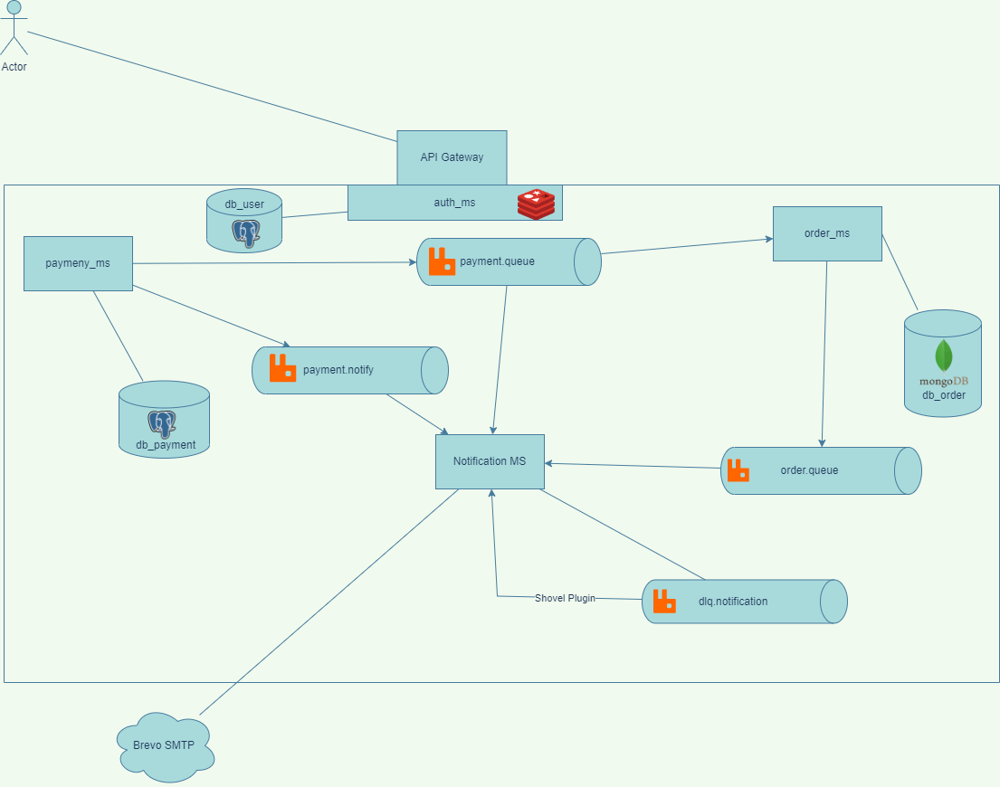

## Rabbitmq playground

### Requisitos

- Java 17
- Docker
- Configurar um SMTP para envio de email no arquivo resources do notification_ms

### Arquitetura

### Endpoints de teste

O API Gateway está rodando em http://localhost:8085


- Realizando o pedido

```
curl -X POST -H "Content-Type: application/json" -d '{
  "email": "josemateus.ufma@gmail.com",
  "cpf": "3803212321",
  "items": [
    {
      "name": "Bicicleta",
      "unitaryAmount": 2040.90
    },
    {
      "name": "IPhone",
      "unitaryAmount": 8030.90
    }
  ]
}' http://localhost:8085/order

```

- Realizando pagamento do pedido

```
curl -X POST -H "Content-Type: application/json" -d '{
  "email": "josemateus.ufma@gmail.com",
  "cpf": "3803212321",
  "orderId": "6522b5d462955b6506dfeef4",
  "status": "SUCCESS",
  "amount": 10000
}' http://localhost:8085/payment

```

Repositório feitos para fins de estudo.